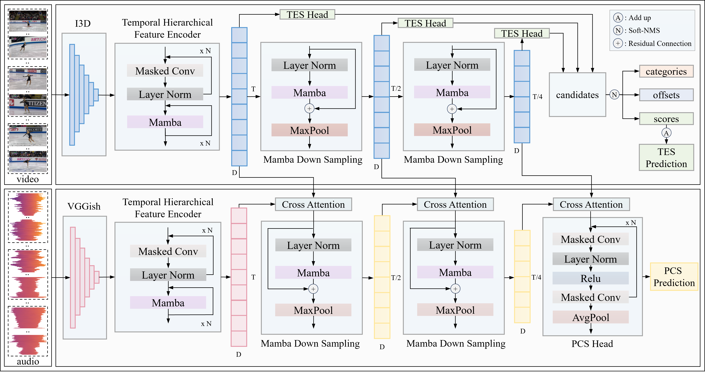

# Learning Long-Range Action Representation by Two-Stream Mamba Pyramid Network for Figure Skating Assessment []() 

## Overview of our method



## Introduction

Technical Element Score (TES) and Program Component Score (PCS) evaluations in figure skating demand precise assessment of athletic actions and artistic interpretation, respectively. Existing methods face three major challenges.

* Firstly, video and audio cues are regarded as common features for both TES and PCS predictions in previous works without considering the prior evaluation criterion of figure skating.
* Secondly, action elements in competitions are separated in time, TES should be derived from each element's score, but existing methods try to give an overall TES prediction without evaluating each action element.
* Thirdly, lengthy competition videos make it difficult to learning long-range contexts.

To address these challenges, we propose a two-stream Mamba pyramid network that aligns with actual judging criteria to predict TES and PCS by separating visual-feature based TES evaluation stream from audio-visual-feature based PCS evaluation stream.

* In the PCS evaluation stream, we introduce a multi-level fusion mechanism to guarantee that video-based features remain unaffected when assessing TES and enhance PCS estimation by fusing visual and auditory cues across each contextual level of the pyramid.
* In the TES evaluation stream, the multi-scale mamba pyramid and TES head we proposed effectively address the challenges of localizing and evaluating action elements with various temporal scales and give the score predictions.
* With Mamba’s superior ability to capture long-range dependencies and its linear computational complexity, our method is ideal for handling lengthy figure skating videos.

## Code Overview

The structure of this code repo is heavily inspired by Detectron2 and ActionFormer. Some of the main components are

* ./libs/core: Parameter configuration module.
* ./libs/datasets: Data loader and IO module.
* ./libs/modeling: Our main model with all its building blocks.
* ./libs/utils: Utility functions for training, inference, and postprocessing.
* ./causal-conv1d: A PyTorch implementation of causal convolution for mamba.
* ./mamba: A PyTorch implementation of Mamba

## Installation

* Follow INSTALL.md for installing necessary dependencies and compiling the code.

## To Reproduce Our Results on FineFS

**Download Features and Annotations**

* Our extracted features and annotations can be download from [baidu link](https://pan.baidu.com/s/118HwLZ-QW41EBRtkYMto3Q?pwd=98in).
* The file includes I3D and VGGish features, annotations in json format.

  The features are extracted using [video features](https://github.com/v-iashin/video_features).

**Unpack Features and Annotations**

* Unpack the file under *./data* (or elsewhere and link to *./data*).
* The folder structure may look like

```
Root folder
│   README.md
│   ...  
│
└───data/
│    └───finefs/
│    │	 └───i3d
│    │	 └───vggish
│    │	 └───annotation/
│    │	     └───1.json
│    │	     └───...
│    └───...
|
└───libs
│
│   ...
```

* Adjust the data path in configs/xx.yaml

  ```
  annotation_folder: /datasets/fs/finefs/,
  vid_feat_folder: /datasets/fs/finefs/i3d,
  aud_feat_folder: /datasets/fs/finefs/vggish,
  class_path: /datasets/fs/finefs/24_class.json,
  ```
  

**Training and Evaluation**

    Please modify the data path in the yaml file first

* Train our model with I3D and VGGish features. This will create an experiment folder under *./ckpt* that stores training config, logs, and checkpoints.

```shell
python ./train.py ./configs/finefs.yaml --output reproduce
```

* [Optional] Monitor the training using TensorBoard

```shell
tensorboard --logdir=./ckpt/finefs/logs
```

* Evaluate the trained model.

```shell
python ./eval.py ./configs/finefs.yaml ./ckpt/finefs/epoch_040.pth.tar
```

## Reference
If you have referenced our code or paper, please consider citing our paper.
```
@inproceedings{wang2025MambaFSA,
  title={Learning Long-Range Action Representation by Two-Stream Mamba Pyramid Network for Figure Skating Assessment},
  author={Wang, Fengshun and Wang, Qiurui and Zhao, Peilin},
  booktitle={Proceedings of the 33rd ACM International Conference on Multimedia},
  pages={867--875},
  year={2025}
}
```
